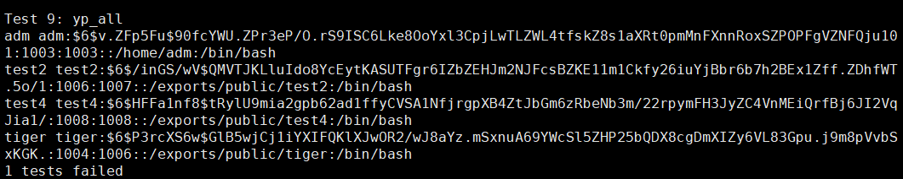

# 服务器管理测试题
## 一、任务准备
本次考核所分配的网段都一样，只是端口不一样，我所分配到的端口如下:
- 218.199.68.187:2015
- 218.199.68.187:2016
- 218.199.68.187:2017
  
  其中root密码均为root，登录三个节点，由于都在同一网段相互之间可以ping通，每台机器使用如下命令ping外网，也可以ping通。
  
  ```bash
  ping www.baidu.com -c 3
  ```

  由于本次使用的是docker技术虚拟出来的机器，导致无法进行reboot重启，否则会导致之前的修改无法生效。所以本次实验都是在不重启的情况下进行

  三台主机的原始主机名和ip如下
  ```bash
  f1cafe4e825a  192.168.3.18/24
  d05d590d09f3  192.168.3.17/24
  f1f512bb06b3  192.168.3.16/24
  ```

  然后我们需要完成5个主要任务，详情见下文。

## 二、任务明细
### 1. 设置三台服务器之间免密登陆并各创建一个名为adm的账户（设置密码），修改主机名分别为node1, node2, node3
#### 1.1 创建adm用户, 以 node1 为例
uaeradd -m参数可以创建用户的HOME目录，可以将/etc/skel目录中的一些系统文件也复制过来
```bash
useradd -m adm
```
userdel 可以删除用户，默认情况下删除/etc/passwd文件中的用户信息，而不会删除属于该用户的系统文件, 加上-r参数会删除/home/adm目录下的所有文件。
```bash
userdel adm
```
设置密码可以使用passwd命令
```bash
passwd adm
```

#### 1.2 永久修改主机名
首先查看当前主机名，直接使用 *hostnamectl* 命令, 主机名包括三种，分别是静态、瞬态或灵活主机名，分别由 *--static、--transient、--pretty*参数控制。

使用 *hostname node1*命令可以临时修改主机名，实现永久更改主机名，需要如下操作：

示例，以node1为例，其余两台也进行相同配置
```bash
#永久性修改，重启后依然生效
hostnamectl --static set-hostname node1
#修改主机名后，/etc/hostname将自动更新，但是/etc/hosts不会自动更新，需要手动修改，并添加以下ip和主机名的映射
vim /etc/hosts

```


#### 1.3设置三台机器之间免密登录
需要提前安装ssh服务，才能使用ssh命令
```bash
yum install -y openssh-clients
```

示例，以node1为例，其他机器也需要执行如下操作
```bash
ssh-keygen -t rsa
cd ~/.ssh/
cat id_rsa.pub >> authorized_keys
ssh-copy-id node1
ssh-copy-id node2
ssh-copy-id node3
#查看是否配置成功
ssh node2 
ssh node3
```

### 2. 在第一台服务器中创建“/public/”目录，并将其挂载到另外两台服务器的/public/位置。（可以使用NFS）
### 2.1 在服务端安装NFS服务器
```bash
# 1、在/exports目录下创建/public 
mkdir /public

# 2、检查之前是否已经安装nfs相关服务
rpm -qa | grep nfs
rpm -qa | grep rpcbind
rpm -qa | grep nfs-utils 

# 3、下载软件包
yum -y install nfs-utils

# 4、启动服务
systemctl start rpcbind
systemctl start nfs

# 5、设置开机自启动（也可以将/etc/init.d/rpcbind start 追加到/etc/rc.local文件中。）
systemctl enable rpcbind
systemctl enable rpcbind

# 6、设置配置文件/etc/exports，设置共享目录为/public, 写上自己的主机ip/子网掩码，以及设置共享文件。
/exports/public 192.168.2.0/24(ro,sync,no_root_squash)

# 7、使用exportfs命令进行挂载，参数r重新挂载/etc/exports设置，v显示共享目录
exportfs -rv

# 8、显示挂载目录即成功

# 9、使用showmount --exports 检查共享目录，结果如下
[root@node1 exports] showmount -e
Export list for node1:
/exports/public 192.168.3.18/24

```
#### 注意事项！
如果是在docker容器技术虚拟出来的机器上搭建，按照如上操作会报错
```bash
exportfs -rv

exportfs: /public does not support NFS export

``` 

原因是出在docker-machine上，如果要使用nfs挂载，需要在机器本身运行modproduce nfs，而不是在容器中运行。解决方法在stackoverflow上有，如下（https://stackoverflow.com/questions/36110703/nfs-in-docker-exportfs-path-does-not-support-nfs-export）, 由于管理员已经在docker机器上设置了export volume，并设置共享目录为/exports，可以将node1的共享目录挂载在 /exports/ 下。


### 2.2 NFS客户端服务器安装
过程和NFS服务端安装类似，以node2为例，node3也一样
```bash
yum -y install nfs-utils
systemctl start rpcbind
systemctl start nfs
systemctl enable nfs
systemctl enable rpcbind
mkdir /public
mountfs -t node1:/exports/public /public

#有时mountfs命令没有，可以使用mount nfs代替
mount -t nfs node2:/public /public

#挂载成功后使用df检查
df
```
最后完成挂载，使用 **df 命令** 检查node2, node3是否挂载成功
```bash
# node2 df 显示结果 最后一行
[root@node2 ~] df -h
Filesystem             Size  Used Avail Use% Mounted on
overlay                1.7T  423G  1.2T  28% /
tmpfs                   64M     0   64M   0% /dev
shm                     64M     0   64M   0% /dev/shm
/dev/sda2              1.7T  423G  1.2T  28% /exports
tmpfs                   32G   17M   32G   1% /run
node1:/exports/public  1.7T  423G  1.2T  28% /public


# node3 df 显示结果 最后一行
[root@node3 ~]  df -h
Filesystem             Size  Used Avail Use% Mounted on
overlay                1.7T  423G  1.2T  28% /
tmpfs                   64M     0   64M   0% /dev
shm                     64M     0   64M   0% /dev/shm
/dev/sda2              1.7T  423G  1.2T  28% /exports
tmpfs                   32G   17M   32G   1% /run
node1:/exports/public  1.7T  423G  1.2T  28% /public

```

### 3. 在第一台服务器中，编写Bash脚本用于创建用户，要求输入的参数有：用户名、用户所属组、账户有效期，用户的根目录为”/public/用户名/”。并在执行后自动将用户同步到另外两台服务器中。（可以使用NIS）

### 3.1 安装 NIS服务器


#### 3.1.1 在 node1 安装 NIS服务端
```bash
# 1、安装 NIS 所需包 ypserv ypbind yptools
yum install -y ypserv ypbind yptools

# 2、检查是否安装成功
rpm -qa | grep "^yp"
#结果如下
yp-tools-2.14-5.el7.x86_64
ypserv-2.31-12.el7.x86_64
ypbind-1.37.1-9.el7.x86_64

# 3、设置 NIS 域名
#检查当前 NIS 域名
[root@node1 ~] nisdomainname
nis
#更改 当前 NIS 域名
[root@node1 ~] nisdomainname node1
[root@node1 ~] nisdomainname
node1
# 开机自启动此域名，在 rc.local 中写入
[root@node1 ~] vi /etc/rc.d/rc.local 
#加入下面这一行
/bin/nisdomainname node1

#在启动 ypbind 时，设置 NIS 域名
[root@node1 ~] vi /etc/sysconfig/network
#加入以下内容
NISDOMAIN=node1

# 4、启动相关服务
systemctl start rpcbind  ypserv  yppasswdd
#设置为开机自启动
systemctl enable rpcbind ypserv  yppasswdd
#使用rpcinfo -p查看启动信息，结果如下
[root@node1 ~] rpcinfo -p
   program vers proto   port  service
    100000    4   tcp    111  portmapper
    100000    3   tcp    111  portmapper
    100000    2   tcp    111  portmapper
    100000    4   udp    111  portmapper
    100000    3   udp    111  portmapper
    100000    2   udp    111  portmapper
    100009    1   udp    805  yppasswdd
    100004    2   udp    804  ypserv
    100004    1   udp    804  ypserv
    100004    2   tcp    808  ypserv
    100004    1   tcp    808  ypserv

# 5、建立数据库
/usr/lib64/yp/ypinit -m
systemctl restart ypserv
# 当有账户信息更新时， 可以重启一下 ypserv或者 make /var/yp
make -C /var/yp
```

#### 3.1.2 在 node2 node3 安装 NIS 客户端，以node2 为例
```bash
# 1、安装所需包
yum install -y yp-tools ypbind
# 检查是否安装成功 
rpm -qa | grep '^yp'
```
安装完成后需要进行配置，配置有两种方法，一种是图形化界面进行配置，还有一种是手动更改配置文件
- *使用 authconfig 图形化界面进行配置*。
如果之前没有安装 authconfig, 需要安装之后才能使用
yum install -y authconfig-gtk 安装完成后。执行如下命令
authconfig-tui 进入图形化界面
然后选择 NIS，空格确定，进入Next
 <center> 图1 authconfig 配置 </center>\
Domain 中填写在 node1 中创建的 nis 域名， Server中也填写 nis 的服务端主机名称，然后配置完成。
 <center> 图2 authconfig 配置 </center>

- *手动更改配置文件*
  - **/etc/nsswitch.conf**（修改许多主机验证功能的顺序）
  在以下四个files后面加入nis 即可
  1. passwd：files nis
  2. shadow files nis
  3. group files nis
  4. hosts files nis

  - **/etc/sysconfig/authconfig** （CentOS的认证机制）
   把 USENIS=no 改为 yes即可
  - **/etc/pam.d/system-auth** （登录所需要用到的PAM机制）
  1. vi /etc/pam.d/system-auth (修改PAM配置文件)
  2. password sufficient /lib/security/$ISA/pam_unix.so nullok use_authtok md shadow **nis**
  - **/etc/yp.conf** (ypbind的配置文件)
  1. vi /etc/yp.conf（编写格式如下）
  2. Domain [NIS 域] Server [ 主机名称]

本次实验采用图形化 authconfig 进行配置，完成后进行如下操作：
```bash
systemctl start rpcbind
systemctl start ypbind
#开机自启动
systemctl enable rpcbind
systemctl enable ypbind
```
#### 3.1.3 NIS 客户端的检验 yptest
在 node1 上创建用户
```bash
useradd -m test -p 123456
useradd -m test1 -p 123456
# 更新yp数据库
make -C /var/yp
```

### 3.2 编写bash脚本创建用户， 输入参数有用户名、用户所属组、账户有效期

#### useradd.sh 脚本实现功能介绍：
- 输入三个参数，包括用户名、用户所属组、账户有效期
- 判断用户输入组名是否存在，如果不存在，就自动创建，再判断用户是否存在，若不存在，就自动创建
- 默认会给用户创建在/exports/public 下面的主目录，可以通过NFS在其他节点/public 目录下共享
- 每次运行脚本最后更新一下数据库，make -C /var/yp 进行NIS服务的数据库更新同步的操作


vim useradd.sh 创建 用户添加脚本，然后使用chmod u+x useradd.sh 变成可执行程序，useradd.sh脚本具体内容如下：

```bash
  1 #!/bin/bash
  2 #adding users using parameters
  3 # $1 is user, $2 is group, $3 is for confirming
  4 echo "创建用户名：$1 创建用户组：$2 用户有效时间：$3 "
  5 #create group if not exists
  6 egrep "^${2}" /etc/group >& /dev/null
  7 if [ $? -ne 0 ]
  8 then
  9     groupadd $2
 10     echo 'Group add successfully'
 11 else
 12     echo "Group already exits! "
 13 fi
 14 
 15 #create user if not exists
 16 egrep "^${1}" /etc/passwd >& /dev/null
 17 if [ $? -ne 0 ]
 18 then
 19     useradd -g ${2} ${1} -e ${3} -d /exports/public/${1}
 20     echo "123456" | passwd --stdin ${1}
 21     make -C /var/yp # update yp database
 22 else
 23     echo " User already exits!"
 24 fi
 25 
```
useradd.sh 脚本使用（**脚本位于/root**）
```bash
./useradd.sh tiger tiger 2021-12-31
```
结果如下图3所示

<center> 图3 useradd.sh 运行结果 </center>

在node2和node3检验是否同步tiger 账户，并检查在node2、node3上/public共享目录中能否看到tiger 账户主目录，结果如下所示（由于node2和node3结果一样，只展示node2结果）：
 <center> 图4 yptest 运行结果 </center>
然后我们查看一下主目录从node1的/exports/public挂载到node2和node3的/public下，结果如下图5所示：

<div align=center>

</div>
<center> 图5 查看共享目录 </center>


### 4. 使用上述的脚本创建四个用户，分别隶属两个组，然后每个组分别删除一个用户，并在三个服务器中同步（如果有配置NIS，请使用NIS实现。如果没有配置NIS，请编写相应的脚本实现）
\
#### 创建test1、test2、test3、test4四个用户，分别隶属于两个组。
test1、test2 隶属于test_group_one，test3和test4隶属于test_group_two, 并在node1、node2、node3三台服务器上同步。
```bash
./useradd.sh test1 test_group_one 2021-12-31
./useradd.sh test2 test_group_one 2021-12-31
./useradd.sh test3 test_group_two 2021-12-31
./useradd.sh test4 test_group_two 2021-12-31
```

#### 在node2节点使用yptest命令查看用户创建是否成功，并查看主目录是否创建成功
结果如下图所示：
 
 


#### 从创建的两个组分别删除两个用户，并用NIS服务器同步

```bash
# 当删除用户执行成功后更新数据库，-r 参数连同主目录一起删除
userdel -r test1 && make -C /var/yp
userdel -r test3 && make -C /var/yp
```
#### 在node2节点 查看是否删除用户成功
 
 


### 5.编写脚本统计该服务器上所有用户的磁盘使用情况，并将结果输出成三列的文件（第一列为用户名，第二列为用户组，第三列为磁盘使用量，单位为GB）

#### show_usage.sh 脚本实现过程介绍：
- 首先需要获取当前磁盘的用户名,以及用户组
- 然后使用du -sh -BG /目录 查看所占磁盘大小（单位为Gb）

show_usage.sh脚本具体内容如下：
  
```bash
  1 #!/bin/bash
  2 # Statistics disk usage
  3 # write in usage.txt
  4 rm -rf usage.txt
  5 for USER in `ls -l /exports/public/ | awk 'NR>1{print $3}'`
  6 do
  7     echo -n `groups $USER | awk -F ':' '{print $1,"\t",$2}'`  >> usage.txt
  8     # calculating the usage of stroage
  9     echo -n -e "\t" >> usage.txt
 10     du -sh -BG "/exports/public/"$USER | awk '{print $1}' >> usage.txt
 11 done

```
运行show_usage.sh 脚本结果如下：
```bash
[root@node1 ~] ./show_usage.sh 
[root@node1 ~] cat usage.txt 
test2 test_group_one	1G
test4 test_group_two	1G

```
